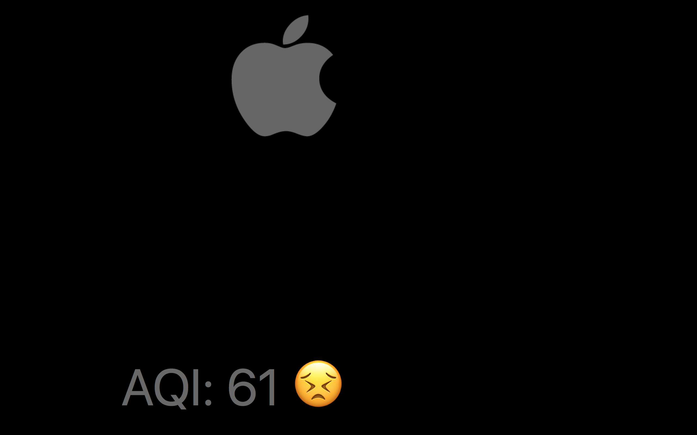
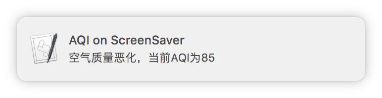

# AQI on ScreenSaver

Air pollution has become a major issue in China, damaging thousands of people's
health every single day. While government and related industrial enterprises is
taking actions on pollution control, you also should pay attention to the air
quality periodically in your living place to decide whether to enable the
protective measures like air purifier. 

There are many ways we can get
[AQI](https://en.wikipedia.org/wiki/Air_quality_index) in our life, it sounds
better we have a yet another way to get AQI when the screen saver turns on.

## Features

* Display AQI on your screen saver
* Update AQI from aqicn.org periodically
* Push notifications when AQI exceed the specified threshold level

## Previews





## Requirements

This script is designed for macOS, cannot be run in other platform.

There are no external dependencies.

Tested on macOS 10.12.

## Installation

First of all, apply for a API token from [this site](http://aqicn.org/data-platform/token/).

```shell
$ git clone https://github.com/aheadlead/aqi-on-screensaver
$ cd aqi-on-screensaver
$ ./aqi-on-screensaver.sh install
```

Installation script will create a service on your launchd daemon. Script
aqi-on-screensaver.sh will be called by launchd periodically to fetch AQI from
aqicn.org, therefore you should keep this script here so that launchd can find
it.

If you want to remove this script, simply run following lines in terminal.

```shell
$ ./aqi-on-screensaver.sh uninstall
```

## Known issues

* The AQI value will not be updated on screen, when the screen saver appear,
  though this script did fetch the AQI value in background.

## Todos

* Provide a option to enable or not.

## Author

Wei Yulan <yulan.wyl@gmail.com>

